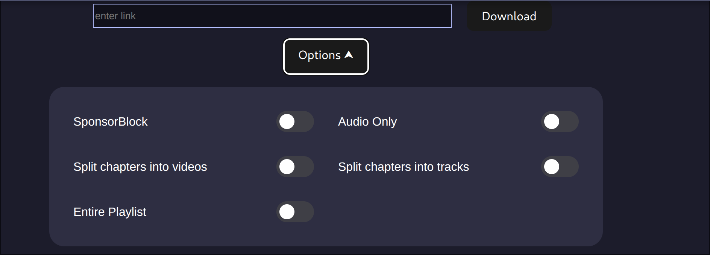
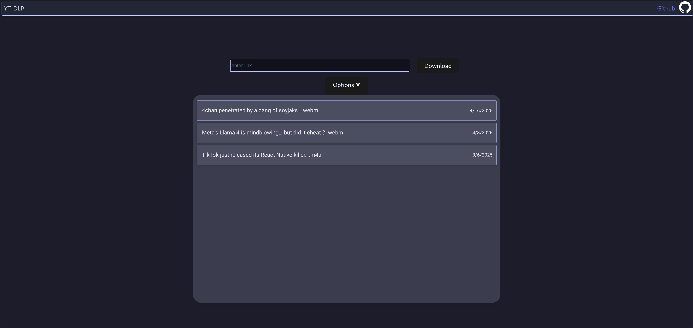

# yt-dlp Docker

This is a docker implementation of [@yt-dlp](https://github.com/yt-dlp/yt-dlp) version [2025.04.30]




## Use

### docker-compose.yml

```yml
version: '3.8'
services:
  ytdlpd:
    image: acidburnmonkey/acidburn-ytdlp:latest
    ports:
      - '8080:5000' # maps external 8080 to internal 5000
    volumes:
      - ./my_downloads:/app/downloads #your volume
    restart: unless-stopped
```

run it

```
docker-compose up -d
```

## Dev

```
npm run dev
cd src & node /serverside/server.js
```
